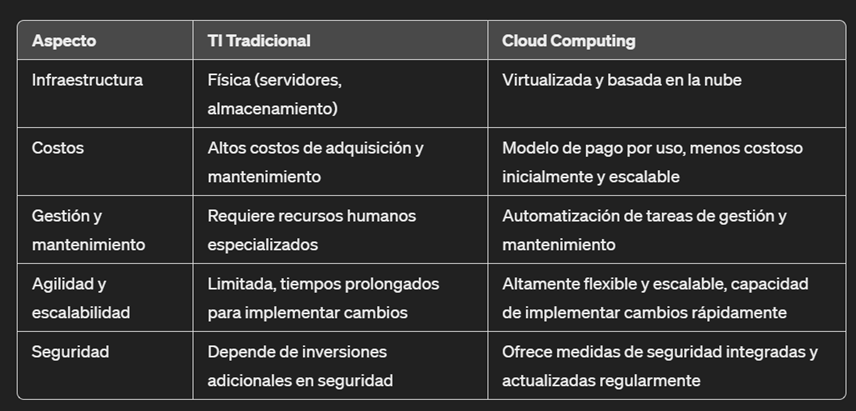

#   Introducción a AWS: Fundamentos de Cloud Computing

##  Conceptos preliminares

### Cómo funciona Internet:

_Internet es una red global de redes de computadoras interconectadas que se comunican entre sí utilizando protocolos estándar de comunicación.
Funciona como una red de carreteras digitales a través de las cuales se transmiten datos en forma de paquetes de información._

#### Modelo request/response:

El modelo request/response es un patrón de comunicación en el que un dispositivo, llamado cliente, envía una solicitud de información a otro dispositivo, llamado servidor, y el servidor responde a esa solicitud proporcionando la información solicitada. Este modelo subyace en muchas interacciones en Internet,como cargar una página web, enviar un correo electrónico o realizar una búsqueda en línea.

Cuando un cliente desea acceder a un recurso en Internet, como una página web, envía una solicitud al servidor que aloja ese recurso. El servidor procesa la solicitud y envía una respuesta de vuelta al cliente, que contiene el recurso solicitado.

#### Resolución DNS:

La resolución DNS (Domain Name System) es el proceso mediante el cual se traduce un nombre de dominio legible por humanos, como **"www.ejemplo.com"**, en una dirección **IP numérica**, que es la forma en que los dispositivos de red identifican y se comunican entre sí en Internet.

Cuando escribes una URL en el navegador web, como "www.ejemplo.com", tu dispositivo necesita la dirección IP del servidor que aloja ese sitio web para cargar la página.

Para obtener esta dirección IP, tu dispositivo realiza una consulta al servidor DNS, que es un servidor especializado encargado de traducir nombres de dominio en direcciones IP.

#### Interacción entre los conceptos:

Imaginemos que deseas acceder al sitio web **"www.ejemplo.com"** desde tu navegador web:

1.  Tu dispositivo (el cliente) envía una solicitud al servidor DNS para traducir el nombre de dominio "www.ejemplo.com" en una dirección IP.

2.  El servidor DNS busca en su base de datos y encuentra la dirección IP asociada con **"www.ejemplo.com"**.

3.  El servidor DNS responde a tu dispositivo con la dirección IP encontrada.

4. Tu dispositivo utiliza esta dirección IP para enviar una solicitud al servidor web que aloja **"www.ejemplo.com"** solicitando la página web.

6. El servidor web procesa la solicitud y envía la página web de vuelta a tu dispositivo como respuesta.

7. Tu dispositivo recibe la página web y la muestra en tu navegador web para que la veas.

_Internet funciona a través de un modelo de comunicación request/response, donde los dispositivos cliente solicitan información a los servidores y estos responden proporcionando la información solicitada._

_**La resolución DNS** es un componente crucial en este proceso, ya que traduce los nombres de dominio en direcciones IP para permitir la comunicación entre dispositivos en Internet._

### Redes

Una red de computadoras es un conjunto de dispositivos electrónicos interconectados entre sí con el propósito de compartir recursos y comunicarse, facilitando la comunicación y el intercambio de información entre los dispositivos conectados.
	   
#### Permiten...
* **Compartir recursos:** Esto puede incluir compartir archivos, impresoras, escáneres y otros dispositivos periféricos entre los usuarios de la red.
* **Comunicación:** Facilitar la comunicación entre usuarios a través de correo electrónico, mensajería instantánea, videoconferencia y otras formas de comunicación en línea.
* **Acceso a la información:** Proporcionar acceso a recursos de información como bases de datos, sitios web y aplicaciones en línea.
* **Centralización de servicios:** Algunas redes centralizan servicios como el almacenamiento de datos, la gestión de usuarios y la seguridad para facilitar su administración y mantenimiento.	   

#### Elementos que intervienen

* **Routers:** Los routers son dispositivos que se utilizan para interconectar redes de computadoras y dirigir el tráfico de datos entre ellas. Funcionan como pasarelas entre diferentes redes y determinan la ruta más eficiente para enviar los datos de un dispositivo a otro. Los routers también pueden proporcionar funciones de seguridad al filtrar el tráfico no deseado y proteger la red contra amenazas externas.
* **Cables:** Los cables son el medio físico a través del cual se transmiten los datos en una red de computadoras. Pueden ser cables de cobre, fibra óptica o conexiones inalámbricas, como Wi-Fi. Los cables conectan los dispositivos entre sí y con otros componentes de red, como switches y routers. Proporcionan el medio de transmisión para enviar y recibir datos de manera confiable y eficiente.
* **Switches:** Los switches son dispositivos que se utilizan para conectar múltiples dispositivos en una red local (LAN). Actúan como concentradores de datos, enviando paquetes de datos solo a los dispositivos destinatarios, en lugar de transmitirlos a todos los dispositivos en la red, como lo haría un hub. Esto mejora la eficiencia y el rendimiento de la red al reducir el tráfico no deseado y evitar congestiones.
* **Switches:** En conjunto, estos componentes permiten la creación de redes de computadoras que conectan equipos y dispositivos entre sí, facilitando la comunicación y el intercambio de información. Los routers dirigen el tráfico entre redes, los cables proporcionan el medio de transmisión y los switches facilitan la comunicación dentro de una misma red
  
Esta interconexión es fundamental para el funcionamiento de Internet y otras redes de comunicación.

Las redes utilizan infraestructura y equipos para conectarnos y compartir información. Las redes de computadoras están compuestas por una variedad de componentes físicos y lógicos que facilitan la comunicación y el intercambio de datos entre dispositivos.

* **Infraestructura:** La infraestructura de una red incluye todos los medios físicos y lógicos necesarios para su funcionamiento. Esto puede incluir cables, dispositivos de red como routers y switches, servidores, centros de datos y otros componentes físicos. La infraestructura proporciona el entorno en el que se lleva a cabo la comunicación y el intercambio de datos en la red.
* **Equipos:** Los equipos en una red son los dispositivos individuales que se conectan entre sí para compartir información. Estos pueden incluir computadoras de escritorio, portátiles, servidores, impresoras, teléfonos inteligentes, tabletas y otros dispositivos con capacidad de red. Cada equipo en la red tiene una dirección única y puede comunicarse con otros equipos utilizando protocolos de red estándar.
* **Conectividad:** La conectividad se refiere a la capacidad de los equipos para comunicarse entre sí a través de la red. Esto se logra mediante la configuración adecuada de la infraestructura de red y la utilización de protocolos de comunicación estándar, como TCP/IP. Los dispositivos de red, como routers y switches, dirigen el tráfico de datos entre los equipos, asegurando que lleguen a su destino de manera eficiente y segura.

### Servidor
_Las aplicaciones requieren estar instaladas en un servidor. Un servidor es un computador que forma parte de una red y proporciona servicios, recursos o funcionalidades a otros dispositivos, programas en una red, o usuarios finales._

Los servidores requieren: 

*   Cómputo: CPU
*   Memoria: RAM
*   Almacenamiento: Datos.
*   Bases de datos: 
*   Información almacenada de forma estructurada.

### On-premises

También conocido como "en las instalaciones" en español, se refiere a la ubicación física de los sistemas informáticos y la infraestructura de tecnología de la información (TI) que se encuentran y son mantenidos dentro de las instalaciones de una organización, en lugar de ser alojados en la nube o en instalaciones externas.

Problemas del enfoque de TI tradicional "on-premise":

La Tecnología de la Información (TI) tradicional ha sido el pilar fundamental en el funcionamiento de las organizaciones durante décadas. Sin embargo, enfrenta una serie de desafíos que pueden obstaculizar la eficiencia y la capacidad de adaptación de las empresas a un entorno empresarial en constante evolución.
El enfoque de TI tradicional "on-premise" implica que las empresas adquieren, instalan y mantienen toda su infraestructura de TI en sus propias instalaciones físicas. Aunque este enfoque ha sido ampliamente utilizado durante décadas, presenta una serie de desafíos y limitaciones que pueden dificultar la eficiencia
y la competitividad de las empresas en la era digital.

Costos de capital elevados: Una de las principales desventajas del enfoque "on-premise" es el alto costo de adquisición de hardware, software y otros equipos de infraestructura de TI. Las empresas deben invertir una gran cantidad de capital inicial para comprar servidores, almacenamiento, equipos de red y otros componentes necesarios para construir y mantener su propia infraestructura de TI.

-Infraestructura costosa y limitada: En la TI tradicional, las empresas suelen invertir en infraestructura física, como servidores, almacenamiento y equipos de red, lo que implica costos significativos tanto en adquisición como en mantenimiento. Además, esta infraestructura tiene una capacidad limitada y puede resultar difícil de escalar para satisfacer las demandas cambiantes del negocio.
-Dificultades en la gestión y mantenimiento: Administrar una infraestructura de TI tradicional puede ser complejo y requerir recursos humanos especializados. La configuración, actualización y mantenimiento de servidores y sistemas operativos pueden consumir mucho tiempo y esfuerzo, lo que puede distraer a los equipos de TI de otras tareas estratégicas.
-Falta de agilidad y escalabilidad: La TI tradicional puede carecer de la flexibilidad necesaria para adaptarse rápidamente a las necesidades del negocio. La implementación de nuevos servicios o la expansión de la capacidad de la infraestructura puede llevar semanas o incluso meses, lo que limita la capacidad de la empresa para responder ágilmente a los cambios en el mercado.

* **Escalabilidad limitada:** La infraestructura de TI "on-premise" puede tener capacidades limitadas de escalabilidad. Las empresas deben estimar y dimensionar cuidadosamente sus necesidades de capacidad de TI futuras y comprar hardware adicional para satisfacer esas demandas. Esto puede resultar en subutilización de recursos si la demanda no coincide con las proyecciones, o en costos adicionales si se requiere una expansión rápida.* **Gestión y mantenimiento complejos:** La gestión y el mantenimiento de la infraestructura de TI en las instalaciones pueden ser complejos y costosos. Las empresas deben emplear personal técnico especializado para configurar, administrar, actualizar y mantener los servidores, sistemas operativos, bases de datos y otros componentes de la infraestructura de TI. Esto puede requerir un gasto adicional en capacitación y recursos humanos.
* **Tiempo de implementación prolongado:** La implementación de nuevos proyectos de TI o la actualización de la infraestructura existente puede llevar mucho tiempo en un entorno "on-premise". La adquisición de hardware, la configuración de software, las pruebas y la puesta en marcha pueden demorar semanas o incluso meses, lo que puede retrasar la entrega de nuevos servicios y afectar la capacidad de respuesta de la empresa.
* **Riesgos de seguridad y pérdida de datos:** La gestión de la seguridad en entornos de TI tradicionales puede ser un desafío, especialmente con el aumento de las amenazas cibernéticas. La protección de datos sensibles y críticos puede requerir una inversión adicional en herramientas y recursos de seguridad, y aún así existen riesgos de brechas de seguridad y pérdida de datos.

## Cloud Compunting

Cloud Computing es un modelo de entrega de servicios de infraestructura, plataformas y aplicaciones bajo demanda a través de una plataforma de servicios en la nube proporcionada por un proveedor de servicios. Este modelo permite el acceso a una amplia gama de recursos informáticos, incluyendo servidores, almacenamiento, bases de datos, herramientas de desarrollo y servicios de infraestructura, entre otros. Los usuarios pueden escalar estos recursos según sea necesario y pagar solo por el uso real o el consumo, lo que brinda flexibilidad, agilidad y optimización de costos a las organizaciones."

### Caracteristicas principales:

* **Escalabildiad:** La capacidad de escalar y desplegar recursos rápidamente según la demanda, lo que agiliza el desarrollo y la entrega de aplicaciones y servicios.

* **Ahorro de costos:** Reducción de los gastos de inversión en infraestructura y mantenimiento, además de pagar solo por lo que se utiliza, lo que optimiza los costos operativos.

* **Elasticidad:** La habilidad de aumentar o disminuir los recursos de manera automática para adaptarse a picos de carga o cambios en la demanda, asegurando un rendimiento óptimo.

* **Global en minutos:** Al eliminar la preocupación por la gestión de infraestructura, los equipos pueden centrarse en la creación y mejora constante de aplicaciones y servicios innovadores.

* **Innovación:** La posibilidad de implementar aplicaciones y recursos en múltiples regiones del mundo de manera rápida y sencilla.

* **Catálogo de servicios:** Acceso a una amplia variedad de servicios preconfigurados, como bases de datos, análisis y machine learning, lo que acelera el desarrollo y ahorra tiempo.

* **Flexibilidad:** La nube ofrece una amplia gama de servicios y herramientas que permiten a las organizaciones adaptar y personalizar sus soluciones de software de acuerdo a sus necesidades específicas. Además, los servicios en la nube suelen estar diseñados para ser interoperables, lo que facilita la integración con otras aplicaciones y sistemas.

* **Agilidad:** Las organizaciones pueden desarrollar, probar y desplegar nuevas aplicaciones y funcionalidades de manera más rápida y eficiente. Al aprovechar los servicios de desarrollo y despliegue en la nube, las organizaciones pueden acelerar el ciclo de desarrollo de software y responder más rápidamente a las demandas del mercado.

* **Disponibilidad y redundancia:** Los proveedores de servicios en la nube ofrecen disponibilidad y redundancia que pueden ser difíciles de lograr con soluciones on-premise. La distribución geográfica de datos y la replicación de recursos de las soluciones en la nube pueden garantizar alta disponibilidad y protección contra fallos.

* **Seguridad:** Contrario a la creencia popular, la nube puede ofrecer niveles de seguridad robustos y superiores a los que pueden lograrse en entornos on-premise. Los proveedores de servicios en la nube invierten fuertemente en medidas de seguridad física, lógica y de cumplimiento, lo que puede resultar en una mejor protección de los datos y sistemas.

* **Facilita la experimentación y la iteración rápida:** Permite desarrollar, probar y desplegar nuevas ideas y soluciones de manera rápida y rentable. Con recursos informáticos escalables y flexibles, las empresas pueden experimentar con diferentes enfoques y adaptarse rápidamente a los cambios en el mercado y las necesidades de los clientes.

* **Reduce barreras de entrada:** Elimina muchas de las barreras tradicionales asociadas con la adquisición y gestión de infraestructura informática, lo que permite a empresas de todos los tamaños y sectores acceder a recursos tecnológicos avanzados y competir en un mercado global.

Los proveedores suelen ofrecer una estructura de precios detallada y transparente que muestra las tarifas por hora, por minuto o por otro período de tiempo, según el servicio y los recursos utilizados.

La flexibilidad es crucial para adaptarse a las necesidades cambiantes del negocio y optimizar el uso de los recursos de manera eficiente.

### Comparativo entre TI Tradicional y Cloud Computing:

## Modelos de Implementación

### Cloud privado

* La organización gestiona y mantiene sus servicios y recursos informáticos, y se alojan en sus instalaciones físicas o en centros de datos dedicados.

* Ofrece mayor control y personalización, pero también requiere una inversión significativa en infraestructura y recursos de gestión.

### Cloud público

* Los servicios y recursos informáticos son proporcionados por un Cloud Provider y se alojan en la infraestructura del proveedor.

* Los usuarios acceden a estos servicios a través de Internet y comparten los recursos con otros clientes del proveedor.

* Ventajas de usar la nube previamente descritas.

### Cloud Híbrido

* Combina elementos de la nube pública y privada.

* Algunos servicios y recursos informáticos son administrados por la organización, y otros son administrados por Cloud Providers.

* Las organizaciones aprovechan los beneficios de la nube pública para cargas de trabajo menos sensibles y mantienen el control de los datos críticos en entornos locales.

## Las cinco características del Cloud computing

* **Autoservicio bajo demanda (on-demand):** Los usuarios pueden aprovisionar recursos y utilizarlos sin interacción humana del proveedor de 
servicios
* **Amplio acceso a la red:** Los recursos están disponibles a través de la red, y pueden ser accedidos por diversas plataformas de  clientes.

* **Alquiler múltiple y agrupación de recursos:** Varios clientes pueden compartir la misma infraestructura y aplicaciones con seguridad y privacidad. 
  
  Múltiples clientes reciben servicio desde los mismos recursos físicos

* **Rápida elasticidad y escalabilidad:**  Adquirir y disponer de recursos de forma automática y rápida cuando sea necesario.
  
  Escala rápida y fácilmente en función de la demanda

* **Servicio medido:** El uso se mide, los usuarios pagan correctamente por lo que han utilizado.

## Tipos de Cloud Computing

## (IaaS) Infraestructura como servicio

* El Cloud Provider ofrece infraestructura de TI virtualizada: servidores, redes, almacenamiento y recursos informáticos (máquinas virtuales y contenedores)
* Los usuarios tienen control total sobre el entorno de computación, incluida la instalación, configuración y gestión de sistemas operativos, middleware, aplicaciones y datos.
* Características clave incluyen escalabilidad flexible, pago por uso, acceso a recursos bajo demanda y eliminación de la necesidad de administrar y mantener hardware físico.

## (PaaS) Plataforma como servicio

* El Cloud Provider ofrece una plataforma de desarrollo y ejecución de aplicaciones que incluye infraestructura, middleware, herramientas de desarrollo, bases de datos y otros servicios relacionados.
* Los usuarios pueden desarrollar, implementar y administrar aplicaciones sin preocuparse por la infraestructura subyacente, centrándose en el desarrollo y la innovación de aplicaciones.
* Características clave incluyen la facilidad de desarrollo y despliegue de aplicaciones, la escalabilidad automática, la administración de bases de datos y la integración con servicios adicionales.

## (SaaS) Software como servicio

* El Cloud Provider ofrece acceso a aplicaciones de software alojadas en la nube a través de Internet, donde los usuarios pueden acceder y utilizar las aplicaciones a través de un navegador web o una API.
* Los usuarios no necesitan preocuparse por la instalación, mantenimiento, actualización o administración de software, ya que todo está gestionado por el proveedor de nube.
* Características clave incluyen acceso bajo demanda a aplicaciones desde cualquier ubicación, actualizaciones automáticas de software, escalabilidad instantánea y modelo de pago por suscripción.

